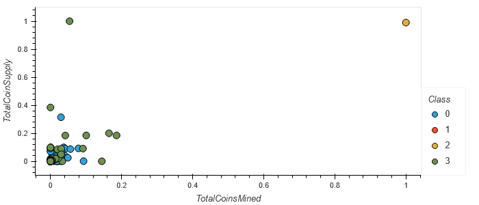

# Cryptocurrencies
## Purpose
Create a report that includes what cryptocurrencies are on the trading market and how they could be grouped to create a classification system for this new investment.

The data needs to be processed to fit the machine learning models. Since there is no known output, unsupervised learning needs to be used. To group the cryptocurrencies, a clustering algorithm is used. Data visualizations are used to share findings.

### Preprocessing

#### Encoding

#### Principal Component Analysis

#### Explained Variance Ratio

The three principal components explain about 6.983% of the variance in this dataset.

#### Elbow Curve

#### K-Means Model

#### Concatenate Dataframe

### Visualizations
#### 3D Scatter Plot of PCA Data and 4 Clusters from clustered_df

#### Hvplot Scatter Plot Using x="TotalCoinsMined" and y="TotalCoinSupply".

#### Hvplot Table with Tradable Currencies 

